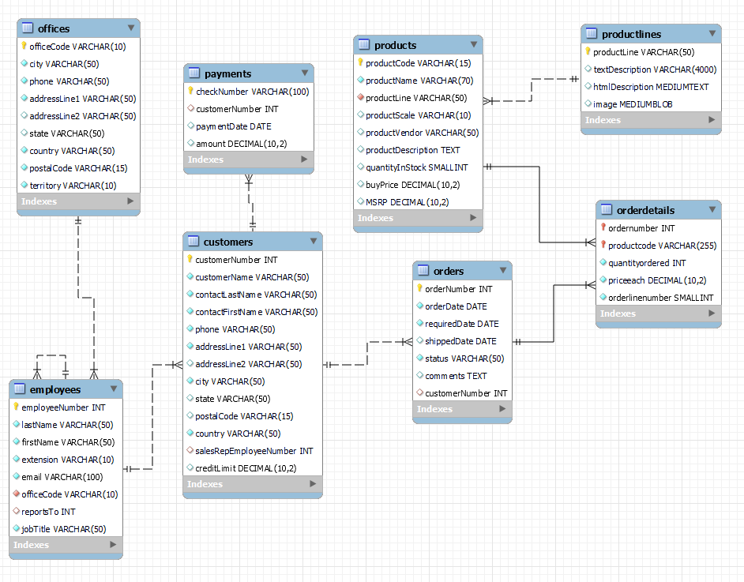

# ClassicModelsSale: Spring Boot Application with MySQL Database


## Overview

This Java Spring Boot application serves as an applied learning platform, conceived after completing both a Udemy course on Spring Boot and an advanced university course in software application development (VSA). The VSA course provided in-depth knowledge of ORM (Object-Relational Mapping) and RESTful web services, essential for designing and implementing multi-layered applications efficiently.

The project specifically aims to solidify concepts such as JDBC, introduction to JPA (Java Persistence API), entity classes, persistence methods, entity manager methods, simple and bidirectional associations, JPA inheritance, and the creation of RESTful services with multiple resources, handling various data formats including XML, and integrating REST with JPA.

By leveraging this application, I'm exploring Spring Framework, databases, RESTful services, JPA, and ORM technologies. The application employs a MySQL sample database to manage and process data, illustrating the practical use of these advanced topics in a real-world scenario.


## Database

The application operates on a well-structured MySQL sample database adapted from the [MySQL Tutorial](https://www.mysqltutorial.org/mysql-sample-database.aspx). The database schema comprises several interconnected tables, including but not limited to `employees`, `customers`, `orders`, `products`, and `payments`. Each table is designed to capture and represent different facets of a business operation from customer management to order fulfillment and product inventory.

Modifications were made to the original schema to better fit the requirements of this application. These changes were necessary to align the database structure with the objectives of the project and to leverage the full capabilities of JPA and ORM within the context of a Spring Boot application.

To facilitate easy setup, I've included the modified database script in the `sql` folder of this repository. This script is essential for recreating the database schema in your own development environment.



You can find the database creation script at `sql/Database.sql`. This script contains all the necessary SQL commands to create the tables and establish the relationships as depicted in the included ER diagram.

To set up the database for use with this application, please execute the SQL script against your MySQL server instance. This will create the database schema and populate the tables with any required initial data.

## Setting Up the Database

To create your local instance of the database, follow these steps:

1. Ensure you have MySQL installed and running on your machine.
2. Open a terminal or command prompt.
3. Navigate to the root directory of the cloned repository.
4. Execute the following command to create the database and its tables:

```bash
mysql -u [username] -p [database_name] < sql/Database.sql
```

5. After setting up the database, configure the application.properties file in the src/main/resources directory to match your local MySQL setup:
```
spring.datasource.url=jdbc:mysql://localhost:3306/[database_name]?useSSL=false&serverTimezone=UTC
spring.datasource.username=[username]
spring.datasource.password=[password]
```
## Current Features

- **REST Controllers (Endpoints)**: The application currently includes RESTful endpoints for CRUD operations, allowing manipulation of the database via HTTP requests.
  
- **Data Persistence**: Leveraging JPA and ORM for effective and efficient data handling.

- **API Documentation**: Simple documentation for APIs created in Postman is available for testing the RESTful services. https://documenter.getpostman.com/view/27281190/2s9YeAAEaL

## Upcoming Features

- **Thymeleaf Integration**: Planning to integrate Thymeleaf to develop a dynamic frontend for the application.

- **Security**: Future updates will include robust security features to protect application data.

- **Enhanced Testing**: Development of comprehensive testing suites using Postman for API testing and JUnit for unit tests.

## Installation

To run this application, you'll need to have Java and Maven installed on your machine. After cloning the repository:

```bash
# Navigate to the cloned repository
cd ClassicModelsSale

# Build the project
mvn clean install

# Run the application
mvn spring-boot:run

# Build the project with Maven
mvn clean install

# Run the application
mvn spring-boot:run
